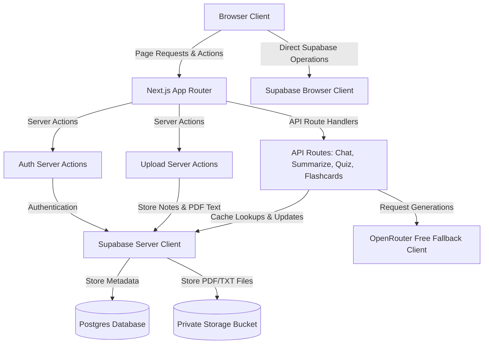

# EduGenie AI - AI System & Developer Reference

EduGenie AI is a free-tier optimized academic assistant designed for students. It allows users to upload notes (via text input or PDF/TXT file upload), generate concise study summaries, practice quizzes, and flashcards, and chat directly with their notes.

This file serves as a comprehensive system manual for AI agents and human developers to understand the design, architecture, schemas, and coding guidelines of the EduGenie AI codebase.

---

## 🗺️ Project Architecture Overview

EduGenie AI is built as a **Next.js 16 App Router** application utilizing **React 19**, **TypeScript**, **Tailwind CSS v4**, and **Supabase (Auth, Postgres database, and private Storage)**. It integrates with **OpenRouter** to use free AI models, enforcing a strict caching and content compaction strategy to protect free-tier API quotas.

### Architecture Map



---

## 🛠️ Technology Stack & Key Dependencies

- **Core Framework**: [Next.js 16.2.6](file:///package.json#L17) (App Router, Server Actions, Server Components)
- **Frontend library**: [React 19.2.4](file:///package.json#L21) / [React-DOM 19.2.4](file:///package.json#L22)
- **Database & Auth Integration**: [@supabase/ssr](file:///package.json#L12) and [@supabase/supabase-js](file:///package.json#L13)
- **Styling & UI**: Tailwind CSS v4, [shadcn/ui](file:///package.json#L23) primitives, and [lucide-react](file:///package.json#L16) icons
- **Text Extraction**: [pdf-parse](file:///package.json#L19) (server-side only)
- **Validation**: [zod](file:///package.json#L27) (runtime payload verification)

---

## 🗄️ Database & Storage Schema

The Postgres database structure is defined in [0001_initial_schema.sql](file:///supabase/migrations/0001_initial_schema.sql). All tables enforce Row-Level Security (RLS) to restrict operations to the owning user.

### Profiles Table
Stores basic user details populated during signup.
- `id`: `uuid` (Primary Key, references `auth.users(id)` cascade)
- `name`: `text`
- `email`: `text`
- `created_at`: `timestamptz` (Default: `now()`)

### Notes Table
Stores the raw extracted text of the uploaded documents.
- `id`: `uuid` (Primary Key, Default: `gen_random_uuid()`)
- `user_id`: `uuid` (References `auth.users(id)` cascade)
- `title`: `text`
- `content`: `text` (Note content, truncated for AI prompts but full in DB)
- `summary`: `text` (Cached AI-generated summary, nullable)
- `file_path`: `text` (Supabase Storage reference path, nullable)
- `created_at`: `timestamptz` (Default: `now()`)

### Quizzes Table
Stores cached AI-generated quizzes to avoid duplicate calls.
- `id`: `uuid` (Primary Key, Default: `gen_random_uuid()`)
- `user_id`: `uuid` (References `auth.users(id)` cascade)
- `note_id`: `uuid` (References `public.notes(id)` cascade)
- `quiz_data`: `jsonb` (Contains `QuizData` format: `{ questions: Array<{ question, options, answer, explanation }> }`)
- `created_at`: `timestamptz` (Default: `now()`)

### Flashcards Table
Stores cached AI-generated flashcard sets.
- `id`: `uuid` (Primary Key, Default: `gen_random_uuid()`)
- `user_id`: `uuid` (References `auth.users(id)` cascade)
- `note_id`: `uuid` (References `public.notes(id)` cascade)
- `flashcard_data`: `jsonb` (Contains `FlashcardData` format: `{ cards: Array<{ front, back }> }`)
- `created_at`: `timestamptz` (Default: `now()`)

### Supabase Storage Bucket
- **Bucket ID**: `note-files`
- **Privacy**: Private (`public = false`)
- **Size Limit**: 10MB (`10485760` bytes)
- **Allowed MIME Types**: `application/pdf`, `text/plain`
- **File Hierarchy**: `{user_id}/{unique_uuid}.{extension}`
- **RLS Policies**: Restricts all select, insert, update, and delete actions to the authenticated user owning the path prefix folder.

---

## 🤖 OpenRouter & AI Client Strategy

The integration with OpenRouter resides in [openrouter.ts](file:///src/lib/openrouter.ts). It addresses two main problems of running a product on free-tier APIs: **Quota limits/Rate limits** and **Context window limits**.

### 1. Free Model Fallback Array
When a request fails due to rate limits or temporary downtime, the client loops through the `FREE_MODELS` array sequentially until a successful response is received:
1. `deepseek/deepseek-chat:free` (Priority)
2. `meta-llama/llama-3.3-70b-instruct:free` (Fallback 1)
3. `google/gemma-2-9b-it:free` (Fallback 2)
4. `mistralai/mistral-7b-instruct:free` (Fallback 3)

### 2. Prompt & Note Content Compaction
To minimize token consumption and match context window realities:
- Notes content is stripped of excessive whitespaces and sliced to maximum bounds using `trimForAi(content, maxChars)`.
- Summaries trim the content to 9,000 characters.
- Quizzes and Flashcards trim the content to 7,000 characters.
- Chats trim the context to 6,500 characters.
- Messages history is sliced to the **last 6 messages** with contents limited to 900 characters each.

### 3. Caching in Postgres
Each API handler checks the Postgres database before calling the LLM:
- **Summaries**: Saved in the `summary` column of the `notes` table. Checked on request; if populated, returns immediately.
- **Quizzes**: Saved in the `quizzes` table. Query retrieves the latest row matching `note_id` and `user_id`.
- **Flashcards**: Saved in the `flashcards` table. Query retrieves the latest row matching `note_id` and `user_id`.
- **Chat**: Not cached since it's interactive, but grounded in note text context.

---

## 📂 Core Directory & File Map

- **[`src/app/`](file:///src/app)**: Contains routes and page layouts.
  - **[`api/`](file:///src/app/api)**: Server route endpoints executing LLM completions.
    - [`chat/route.ts`](file:///src/app/api/chat/route.ts): Grounded chat response handler.
    - [`flashcards/route.ts`](file:///src/app/api/flashcards/route.ts): Flashcards generator + cache checker.
    - [`quiz/route.ts`](file:///src/app/api/quiz/route.ts): Quiz generator + cache checker.
    - [`summarize/route.ts`](file:///src/app/api/summarize/route.ts): Summary generator + cache writer.
  - **[`auth/`](file:///src/app/auth)**: Auth logic.
    - [`actions.ts`](file:///src/app/auth/actions.ts): Server Actions for user `login`, `signup`, and `logout`.
    - [`callback/route.ts`](file:///src/app/auth/callback/route.ts): Supabase email verification code exchange handler.
  - **[`dashboard/`](file:///src/app/dashboard)**: User stats, recent note previews, and user summaries count.
  - **[`upload/`](file:///src/app/upload)**: Note submission forms and parsing triggers.
    - [`actions.ts`](file:///src/app/upload/actions.ts): Server action to process form values, extract PDF/TXT text, upload files to storage, and save to Postgres.
  - **[`settings/`](file:///src/app/settings)**: Configuration page showcasing active fallback routes.
- **[`src/components/`](file:///src/components)**: Core features and layout elements.
  - [`ai-generate-panel.tsx`](file:///src/components/ai-generate-panel.tsx): Dual-card component managing selection, generation states, and UI render profiles for summaries, quizzes, and flashcards.
  - [`chat-panel.tsx`](file:///src/components/chat-panel.tsx): Handles note-grounded conversation exchanges.
  - [`upload-form.tsx`](file:///src/components/upload-form.tsx): Interactive form accepting files and pasted text.
  - [`auth-form.tsx`](file:///src/components/auth-form.tsx): Dual-mode login/registration window.
  - [`app-sidebar.tsx`](file:///src/components/app-sidebar.tsx): App navigation rail with responsive drawer support.
- **[`src/lib/`](file:///src/lib)**: Shared utility classes.
  - [`openrouter.ts`](file:///src/lib/openrouter.ts): API client, fallback routing, and schemas.
  - [`study-data.ts`](file:///src/lib/study-data.ts): User verification helpers (`requireUser`, `getDashboardData`).
  - [`pdf.ts`](file:///src/lib/pdf.ts): Server-only PDF loader.
  - **[`supabase/`](file:///src/lib/supabase)**: Client factory interfaces.
    - [`client.ts`](file:///src/lib/supabase/client.ts): Browser client builder.
    - [`server.ts`](file:///src/lib/supabase/server.ts): Server client builder with Next.js headers/cookies injection.
    - [`proxy.ts`](file:///src/lib/supabase/proxy.ts): Middleware session refresher.
- **[`src/types/`](file:///src/types)**:
  - [`study.ts`](file:///src/types/study.ts): Zod and TypeScript structures for `Note`, `QuizQuestion`, `QuizData`, `Flashcard`, `FlashcardData`, and `ChatMessage`.

---

## 🎨 Design & Styling System

EduGenie AI implements a **Dark Academic SaaS aesthetic** with high-contrast UI borders, glassmorphic card overlays, radial background gradients, and sleek micro-animations.

### Styling Standards
- **Global Variables**: Defined using OKLCH color notations in [globals.css](file:///src/app/globals.css) under `:root`.
- **Backgrounds**: A standard radial gradient is applied at the body level to create subtle lighting details behind elements.
- **Tailwind Version**: Tailwind CSS v4. Styles are declared through inline utilities or compiled using modern `@import "tailwindcss"` features.
- **Toast Notifications**: Managed globally using the `Toaster` and `toast` instances from `sonner`.

---

## 🛡️ Security & Privacy Guardrails

1. **API Keys Protection**:
   - `OPENROUTER_API_KEY` is a server-only environment variable.
   - It **MUST NOT** be exposed to client-side components or prefixed with `NEXT_PUBLIC_`.
   - All completions go through Next.js server route handlers.
2. **Data Separation**:
   - All tables enforce Row-Level Security policies checking if `auth.uid() = user_id`.
   - Storage folder structures use `{user_id}/` prefixes. The policies enforce that users can only interact with files matching their authenticated UUID.
3. **Session Verification**:
   - Routes check user sessions via server component checks (`requireUser`).
   - Sessions are kept alive using the middleware proxy configuration (`src/proxy.ts` / `src/lib/supabase/proxy.ts`).

---

## 💻 Developer Commands

To test and execute code modifications, use the following commands:

- **Start Development Server**:
  ```bash
  npm run dev
  ```
- **Lint Code**:
  ```bash
  npm run lint
  ```
- **Compile Production Bundle**:
  ```bash
  npm run build
  ```
- **Run migrations**:
  Apply SQL schemas located in [0001_initial_schema.sql](file:///supabase/migrations/0001_initial_schema.sql) in your Supabase project SQL Editor.
